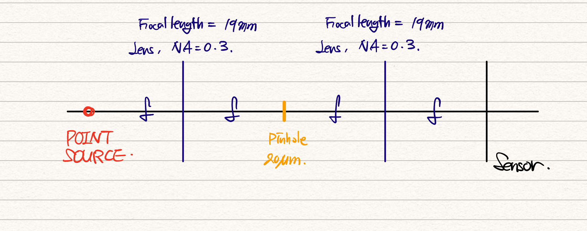

# Spatial Filtered PSF

## Optical System



## Experiments

### Spatial Sampling Rate

$$
\Delta x \leq {\lambda\over 2 \text{NA}}
$$

where $\Delta x$ is the pixel size, $\lambda$ is a wavelength, and $\text{NA}$ is a numerical aperture ($\text{NA} = n\sin \theta$).

#### 1. PSFs on Sensor with varying wavelengths
**Pixel size = 5µm [Beyond the sampling criterion]**
  
- Based on the default setting, I set the pixel size as 5µm (this is beyond the sampling criterion)


- These results demonstrate strange patterns... This is caused by aliasing error (according to the above sampling rate criterion.)

#### 2. PSFs on Sensor with varying wavelengths
**Pixel size = 1µm [Approximately equal to the sampling criterion]**


- These results show ideal PSF pattern (Airy function with almost only the main lobe.)
- However, in the 1.55µm wavelength setting, the propagator is entirely filtered because of the band-limit operation in ASM propagator.
- The band-limit of propagator is proportional to the pixel size $\Delta x$ and inversely proportional to the wavelength $\lambda$.  

$$
|f_x| \leq {1 \over [(2\Delta u z)^2 + 1]^{1\over 2} \lambda}
$$
- The above definition is band-limit of ASM propagator, where $\Delta u = 1/L$ and $L = N \Delta x$.$^{[2]}$

- Therefore, it is important to find the balance among the parameters regarding to the given bounds.


### Results with various wavelengths adn NA values.


***Note that these results are derived by conducting the "iterative_perform" function.***

- I set the conditions artificially, like the below parameters, to clearly show the changed characteristics.
```python
this_kwargs = dict(
    pixel_size=[0.5, 0.5],
    pixel_num=[300, 300],
    lamb0=[lamb0],
    refractive_index=1,
    paraxial=False,
    focal_length=1*1e3,
    NA=NA,
    pinhole_width=100,
    nyquist_spatial_bound=False
)
```
- Propagation distance is smaller than the default setting.
- I set the pinhole_width as a large value, 100µm, to clearly show the various orders of the airy funcion.
- Smaller wavelength settings demonstrate the larger number of orders of airy function.
- At the glance, there is no change in tendency with various NA setting. But, it significantly impacts on the bounds and bandlimit conditions. I manipulated NA value and wavelength parameters to satisfy and approximate band-limited condition in both frequency (ASM propagator) and spatial domain (sampling rate).

[1] Dep et al. - 2022 - FourierNets enable the design of highly non-local optical encoders for computational imaging.
[2] Matsushima and Shimobaba - 2009 - Band-limited angular spectrum method for numerical simulation of free-space propagation in far and near-fields.